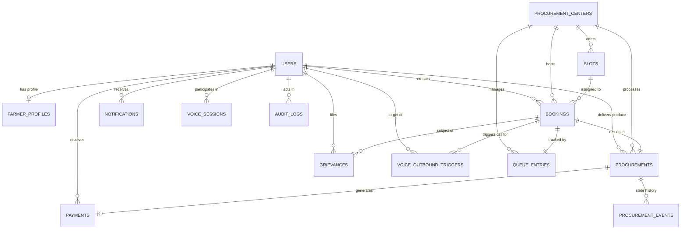

# SmartProcure — Database Schema & Data Architecture

**Project:** SmartProcure  
**SIH Problem Statement:** SIH26032  
**Architecture Reference:** SmartProcure Architecture v3.0 Section 18  
**Theme:** Smart Automation (Ministry of Consumer Affairs, Food & Public Distribution)  
**Database Engine:** PostgreSQL / Supabase  

---

## 1. Entity-Relationship (ER) Diagram



---

## 2. Table Specifications & Data Dictionary

### 2.1 `users`
Core user identity for Farmers, Procurement Officers, and Administrators.

| Column | Type | Constraints | Description |
|---|---|---|---|
| `id` | UUID | PRIMARY KEY, DEFAULT `uuid_generate_v4()` | Unique user identifier |
| `name` | VARCHAR(255) | NOT NULL | User's full name |
| `mobile` | VARCHAR(15) | UNIQUE, NOT NULL | Mobile number (used for OTP auth) |
| `role` | VARCHAR(50) | NOT NULL, CHECK in (`FARMER`, `OFFICER`, `ADMIN`) | Access authorization role |
| `language` | VARCHAR(10) | DEFAULT `'en'`, CHECK in (`en`, `hi`, `te`) | User language preference |
| `avatar_url` | TEXT | NULLABLE | Profile avatar image link |
| `created_at` | TIMESTAMPTZ | DEFAULT `NOW()` | Timestamp of creation |
| `updated_at` | TIMESTAMPTZ | DEFAULT `NOW()` | Timestamp of last modification |

### 2.2 `farmer_profiles`
Agricultural identity, landholding, and verification data for farmers.

| Column | Type | Constraints | Description |
|---|---|---|---|
| `id` | UUID | PRIMARY KEY, DEFAULT `uuid_generate_v4()` | Profile identifier |
| `user_id` | UUID | NOT NULL, FK $\to$ `users(id)` ON DELETE CASCADE | Associated user account |
| `farmer_id_code` | VARCHAR(50) | UNIQUE, NOT NULL | National/State farmer ID (e.g. `SP-FARMER-1082`) |
| `is_aadhaar_verified` | BOOLEAN | DEFAULT `FALSE` | Aadhaar KYC status flag |
| `land_size_acres` | NUMERIC(8, 2) | NOT NULL, DEFAULT 0, CHECK $\ge$ 0 | Operational landholding |
| `land_village` | VARCHAR(255) | NULLABLE | Village name |
| `land_district` | VARCHAR(255) | NULLABLE | Mandi district |
| `land_state` | VARCHAR(255) | NULLABLE | State |
| `land_document_url` | TEXT | NULLABLE | Land ownership registry document |
| `bank_account_number_masked` | VARCHAR(50) | NULLABLE | Masked account for DBT (e.g. `XXXX-XXXX-4812`) |
| `bank_ifsc` | VARCHAR(20) | NULLABLE | Bank IFSC code |
| `bank_name` | VARCHAR(255) | NULLABLE | Bank title |
| `crops_grown` | TEXT[] | DEFAULT `'{}'` | Supported crops grown |
| `created_at` | TIMESTAMPTZ | DEFAULT `NOW()` | Timestamp |
| `updated_at` | TIMESTAMPTZ | DEFAULT `NOW()` | Auto-updated |

### 2.3 `procurement_centers`
Authorized procurement mandis and terminal grain warehouses.

| Column | Type | Constraints | Description |
|---|---|---|---|
| `id` | UUID | PRIMARY KEY, DEFAULT `uuid_generate_v4()` | Center identifier |
| `name` | VARCHAR(255) | NOT NULL | Center facility name |
| `code` | VARCHAR(50) | UNIQUE, NOT NULL | Center unique code (e.g. `CTR-01`, `CTR-02`) |
| `address` | TEXT | NOT NULL | Physical address |
| `district` | VARCHAR(100) | NOT NULL | District name |
| `state` | VARCHAR(100) | NOT NULL | State name |
| `latitude` | NUMERIC(10, 6) | NOT NULL | GPS latitude |
| `longitude` | NUMERIC(10, 6) | NOT NULL | GPS longitude |
| `daily_capacity_quintals` | NUMERIC(10, 2) | NOT NULL, DEFAULT 500, CHECK $> 0$ | Total daily intake capacity |
| `current_load_percent` | INT | NOT NULL, DEFAULT 0, CHECK 0..100 | Real-time intake load percentage |
| `processing_rate_min_per_farmer` | INT | NOT NULL, DEFAULT 6, CHECK $> 0$ | Average throughput rate per farmer |
| `status` | VARCHAR(50) | DEFAULT `'OPEN'`, CHECK (`OPEN`, `CLOSED`, `MAINTENANCE`) | Operational state |
| `load_status` | VARCHAR(50) | DEFAULT `'NORMAL'`, CHECK (`NORMAL`, `BUSY`, `HIGH`, `CRITICAL`) | Load category |
| `operating_hours` | JSONB | DEFAULT `'{"open": "08:00 AM", "close": "06:00 PM"}'` | Operating schedule |
| `supported_crops` | TEXT[] | DEFAULT `'{"Paddy", "Wheat"}'` | Eligible commodities |
| `contact_phone` | VARCHAR(50) | NULLABLE | Yard supervisor contact |
| `created_at` | TIMESTAMPTZ | DEFAULT `NOW()` | Timestamp |
| `updated_at` | TIMESTAMPTZ | DEFAULT `NOW()` | Auto-updated |

### 2.4 `slots`
Time windows allocated for arrival coordination.

| Column | Type | Constraints | Description |
|---|---|---|---|
| `id` | UUID | PRIMARY KEY, DEFAULT `uuid_generate_v4()` | Slot identifier |
| `center_id` | UUID | NOT NULL, FK $\to$ `procurement_centers(id)` ON DELETE CASCADE | Associated center |
| `date` | DATE | NOT NULL | Calendar date |
| `start_time` | VARCHAR(20) | NOT NULL | Arrival window start (e.g. `10:00 AM`) |
| `end_time` | VARCHAR(20) | NOT NULL | Arrival window end (e.g. `12:00 PM`) |
| `capacity` | INT | NOT NULL, DEFAULT 15, CHECK $> 0$ | Max vehicles allowed in slot |
| `booked_count` | INT | NOT NULL, DEFAULT 0, CHECK $\le$ capacity | Number of confirmed bookings |
| `status` | VARCHAR(50) | DEFAULT `'AVAILABLE'`, CHECK (`AVAILABLE`, `FULL`, `CANCELLED`) | Availability state |
| `created_at` | TIMESTAMPTZ | DEFAULT `NOW()` | Timestamp |
| `updated_at` | TIMESTAMPTZ | DEFAULT `NOW()` | Auto-updated |
| *Constraint* | UNIQUE | `(center_id, date, start_time, end_time)` | Prevents duplicate slot windows |

### 2.5 `bookings`
Confirmed arrival appointment for a farmer.

| Column | Type | Constraints | Description |
|---|---|---|---|
| `id` | UUID | PRIMARY KEY, DEFAULT `uuid_generate_v4()` | Booking identifier |
| `farmer_id` | UUID | NOT NULL, FK $\to$ `users(id)` ON DELETE CASCADE | Booking farmer |
| `center_id` | UUID | NOT NULL, FK $\to$ `procurement_centers(id)` ON DELETE CASCADE | Chosen mandi |
| `slot_id` | UUID | FK $\to$ `slots(id)` ON DELETE SET NULL | Scheduled slot |
| `crop` | VARCHAR(100) | NOT NULL | Crop commodity |
| `quantity_quintals` | NUMERIC(10, 2) | NOT NULL, CHECK $> 0$ | Estimated crop weight |
| `token_number` | VARCHAR(50) | UNIQUE, NOT NULL | Public token ID (e.g. `SP-1047`) |
| `qr_code_payload` | TEXT | NULLABLE | Verification payload for yard scanning |
| `status` | VARCHAR(50) | DEFAULT `'CONFIRMED'`, CHECK (`CONFIRMED`, `PENDING`, `CANCELLED`, `COMPLETED`) | Booking status |
| `created_at` | TIMESTAMPTZ | DEFAULT `NOW()` | Timestamp |
| `updated_at` | TIMESTAMPTZ | DEFAULT `NOW()` | Auto-updated |

### 2.6 `queue_entries`
Real-time line tracking inside the procurement yard.

| Column | Type | Constraints | Description |
|---|---|---|---|
| `id` | UUID | PRIMARY KEY, DEFAULT `uuid_generate_v4()` | Queue entry identifier |
| `booking_id` | UUID | NOT NULL, FK $\to$ `bookings(id)` ON DELETE CASCADE | Associated booking |
| `center_id` | UUID | NOT NULL, FK $\to$ `procurement_centers(id)` ON DELETE CASCADE | Mandi queue |
| `token_number` | VARCHAR(50) | NOT NULL | Public token |
| `position` | INT | NOT NULL, CHECK $\ge 1$ | Current position in queue |
| `farmers_ahead` | INT | NOT NULL, DEFAULT 0, CHECK $\ge 0$ | Farmers ahead in line |
| `estimated_wait_minutes` | INT | NOT NULL, DEFAULT 0, CHECK $\ge 0$ | Calculated ETA to gate |
| `status` | VARCHAR(50) | DEFAULT `'WAITING'`, CHECK (`WAITING`, `ARRIVED`, `INSPECTION`, `GRADING`, `WEIGHING`, `VERIFICATION`, `COMPLETED`, `CANCELLED`) | Queue stage |
| `checked_in_at` | TIMESTAMPTZ | NULLABLE | Gate barrier check-in time |
| `created_at` | TIMESTAMPTZ | DEFAULT `NOW()` | Timestamp |
| `updated_at` | TIMESTAMPTZ | DEFAULT `NOW()` | Auto-updated |

### 2.7 `procurements`
Full transaction record for physical produce intake, quality inspection, and weighing.

| Column | Type | Constraints | Description |
|---|---|---|---|
| `id` | UUID | PRIMARY KEY, DEFAULT `uuid_generate_v4()` | Procurement record identifier |
| `booking_id` | UUID | NOT NULL, FK $\to$ `bookings(id)` ON DELETE CASCADE | Source booking |
| `farmer_id` | UUID | NOT NULL, FK $\to$ `users(id)` ON DELETE CASCADE | Producer |
| `center_id` | UUID | NOT NULL, FK $\to$ `procurement_centers(id)` ON DELETE CASCADE | Facility |
| `crop` | VARCHAR(100) | NOT NULL | Commodity |
| `estimated_quantity_quintals` | NUMERIC(10, 2) | NOT NULL, CHECK $> 0$ | Self-declared weight |
| `accepted_quantity_quintals` | NUMERIC(10, 2) | NULLABLE, CHECK $\ge 0$ | Weighbridge verified net weight |
| `inspection_status` | VARCHAR(50) | DEFAULT `'PENDING'`, CHECK (`PENDING`, `IN_PROGRESS`, `APPROVED`, `REJECTED`) | Quality signoff |
| `inspection_notes` | TEXT | NULLABLE | Inspector remarks |
| `grade` | VARCHAR(50) | NULLABLE | Quality grade (e.g. `Grade A`, `FAQ`) |
| `moisture_percent` | NUMERIC(5, 2) | NULLABLE, CHECK 0..100 | Measured grain moisture (FCI $\le 12\%$) |
| `weighing_status` | VARCHAR(50) | DEFAULT `'PENDING'`, CHECK (`PENDING`, `IN_PROGRESS`, `COMPLETED`) | Weighbridge status |
| `verification_status` | VARCHAR(50) | DEFAULT `'PENDING'`, CHECK (`PENDING`, `VERIFIED`, `FLAGGED`) | Officer verification |
| `status` | VARCHAR(50) | DEFAULT `'BOOKED'`, CHECK (`BOOKED`, `ARRIVED`, `INSPECTION`, `GRADING`, `WEIGHING`, `VERIFICATION`, `COMPLETED`, `PAYMENT`) | Lifecycle status |
| `created_at` | TIMESTAMPTZ | DEFAULT `NOW()` | Timestamp |
| `updated_at` | TIMESTAMPTZ | DEFAULT `NOW()` | Auto-updated |

### 2.8 `procurement_events`
Immutable audit log tracking every lifecycle transition in the state machine.

| Column | Type | Constraints | Description |
|---|---|---|---|
| `id` | UUID | PRIMARY KEY, DEFAULT `uuid_generate_v4()` | Event identifier |
| `procurement_id` | UUID | NOT NULL, FK $\to$ `procurements(id)` ON DELETE CASCADE | Transaction |
| `stage` | VARCHAR(50) | NOT NULL, CHECK (`BOOKED`, `ARRIVED`, `INSPECTION`, `GRADING`, `WEIGHING`, `VERIFICATION`, `COMPLETED`, `PAYMENT`) | State reached |
| `status` | VARCHAR(50) | NOT NULL | Result/status |
| `actor_id` | UUID | FK $\to$ `users(id)` ON DELETE SET NULL | Officer or farmer responsible |
| `actor_name` | VARCHAR(255) | NULLABLE | Name of actor |
| `notes` | TEXT | NULLABLE | Operational remarks |
| `created_at` | TIMESTAMPTZ | DEFAULT `NOW()` | Timestamp |

### 2.9 `payments`
Direct Benefit Transfer (DBT) and MSP financial settlement records.

| Column | Type | Constraints | Description |
|---|---|---|---|
| `id` | UUID | PRIMARY KEY, DEFAULT `uuid_generate_v4()` | Payment identifier |
| `procurement_id` | UUID | NOT NULL, FK $\to$ `procurements(id)` ON DELETE CASCADE | Associated delivery |
| `farmer_id` | UUID | NOT NULL, FK $\to$ `users(id)` ON DELETE CASCADE | Payee |
| `crop` | VARCHAR(100) | NOT NULL | Crop commodity |
| `accepted_quantity_quintals` | NUMERIC(10, 2) | NOT NULL, CHECK $> 0$ | Net verified quantity |
| `rate_per_quintal` | NUMERIC(10, 2) | NOT NULL, CHECK $> 0$ | Government MSP rate |
| `gross_amount` | NUMERIC(12, 2) | NOT NULL, CHECK $\ge 0$ | `quantity * rate` |
| `deductions_amount` | NUMERIC(10, 2) | DEFAULT 0, CHECK $\ge 0$ | Cleaning / moisture deductions |
| `net_amount` | NUMERIC(12, 2) | NOT NULL, CHECK $\ge 0$ | `gross - deductions` |
| `status` | VARCHAR(50) | DEFAULT `'PENDING'`, CHECK (`PENDING`, `PROCESSING`, `CREDITED`, `FAILED`) | Settlement state |
| `transaction_reference` | VARCHAR(100) | NULLABLE | DBT transaction ID |
| `bank_account_masked` | VARCHAR(50) | NULLABLE | Account receiving credit |
| `credited_date` | DATE | NULLABLE | Transfer credit date |
| `created_at` | TIMESTAMPTZ | DEFAULT `NOW()` | Timestamp |
| `updated_at` | TIMESTAMPTZ | DEFAULT `NOW()` | Auto-updated |

### 2.10 `notifications`
Multi-channel notification alerts dispatched to farmers and officers.

| Column | Type | Constraints | Description |
|---|---|---|---|
| `id` | UUID | PRIMARY KEY, DEFAULT `uuid_generate_v4()` | Notification identifier |
| `user_id` | UUID | NOT NULL, FK $\to$ `users(id)` ON DELETE CASCADE | Recipient |
| `type` | VARCHAR(50) | NOT NULL, CHECK in (`booking`, `queue`, `procurement`, `payment`, `alert`, `general`) | Category |
| `title` | VARCHAR(255) | NOT NULL | Alert heading |
| `message` | TEXT | NOT NULL | Concise instruction |
| `is_read` | BOOLEAN | DEFAULT `FALSE` | Read status |
| `action_target` | TEXT | NULLABLE | In-app routing destination |
| `created_at` | TIMESTAMPTZ | DEFAULT `NOW()` | Timestamp |

### 2.11 `grievances`
Farmer dispute resolution and grievance redressal tickets.

| Column | Type | Constraints | Description |
|---|---|---|---|
| `id` | UUID | PRIMARY KEY, DEFAULT `uuid_generate_v4()` | Ticket identifier |
| `farmer_id` | UUID | NOT NULL, FK $\to$ `users(id)` ON DELETE CASCADE | Complainant |
| `booking_id` | UUID | FK $\to$ `bookings(id)` ON DELETE SET NULL | Related appointment |
| `category` | VARCHAR(50) | NOT NULL, CHECK in (`DELAY`, `QUALITY_DISPUTE`, `PAYMENT`, `FACILITY`, `OTHER`) | Grievance topic |
| `title` | VARCHAR(255) | NOT NULL | Brief summary |
| `description` | TEXT | NOT NULL | Detailed issue statement |
| `document_url` | TEXT | NULLABLE | Attached evidence link |
| `status` | VARCHAR(50) | DEFAULT `'SUBMITTED'`, CHECK in (`SUBMITTED`, `UNDER_REVIEW`, `RESOLVED`, `REJECTED`) | Resolution progress |
| `resolution_notes` | TEXT | NULLABLE | Officer's resolution statement |
| `created_at` | TIMESTAMPTZ | DEFAULT `NOW()` | Timestamp |
| `updated_at` | TIMESTAMPTZ | DEFAULT `NOW()` | Auto-updated |

### 2.12 `audit_logs`
Administrative and security action trail.

| Column | Type | Constraints | Description |
|---|---|---|---|
| `id` | UUID | PRIMARY KEY, DEFAULT `uuid_generate_v4()` | Audit identifier |
| `actor_id` | UUID | FK $\to$ `users(id)` ON DELETE SET NULL | User performing action |
| `actor_role` | VARCHAR(50) | NOT NULL | Actor role at time of action |
| `action` | VARCHAR(255) | NOT NULL | Action key (e.g. `UPDATE_CAPACITY`) |
| `entity_type` | VARCHAR(100) | NOT NULL | Table affected |
| `entity_id` | VARCHAR(100) | NOT NULL | Record ID affected |
| `metadata` | JSONB | DEFAULT `'{}'` | Snapshot of before/after changes |
| `created_at` | TIMESTAMPTZ | DEFAULT `NOW()` | Timestamp |

### 2.13 `voice_sessions`
Inbound and interactive Voice Agent dialog sessions.

| Column | Type | Constraints | Description |
|---|---|---|---|
| `id` | UUID | PRIMARY KEY, DEFAULT `uuid_generate_v4()` | Session identifier |
| `farmer_id` | UUID | FK $\to$ `users(id)` ON DELETE SET NULL | Authenticated farmer |
| `call_id` | VARCHAR(100) | UNIQUE, NOT NULL | Telephony/Web call reference |
| `language` | VARCHAR(10) | DEFAULT `'en'`, CHECK in (`en`, `hi`, `te`) | Spoken language |
| `channel` | VARCHAR(50) | NOT NULL, DEFAULT `'web'` | Channel (`web`, `telephony`) |
| `started_at` | TIMESTAMPTZ | DEFAULT `NOW()` | Call start |
| `ended_at` | TIMESTAMPTZ | NULLABLE | Call completion |
| `last_intent` | VARCHAR(100) | NULLABLE | Last intent resolved |
| `status` | VARCHAR(50) | DEFAULT `'ACTIVE'`, CHECK in (`ACTIVE`, `COMPLETED`, `DISCONNECTED`, `FAILED`) | Call status |

### 2.14 `voice_outbound_triggers`
Queue and ETA event-driven automated outbound voice notifications.

| Column | Type | Constraints | Description |
|---|---|---|---|
| `id` | UUID | PRIMARY KEY, DEFAULT `uuid_generate_v4()` | Trigger identifier |
| `event_type` | VARCHAR(100) | NOT NULL | Event (e.g. `QUEUE_SURGE`, `SLOT_UPDATE`) |
| `farmer_id` | UUID | NOT NULL, FK $\to$ `users(id)` ON DELETE CASCADE | Targeted farmer |
| `booking_id` | UUID | NOT NULL, FK $\to$ `bookings(id)` ON DELETE CASCADE | Associated transaction |
| `title` | VARCHAR(255) | NOT NULL | Call title |
| `message_script` | TEXT | NOT NULL | TTS message script to speak |
| `language` | VARCHAR(10) | DEFAULT `'en'`, CHECK in (`en`, `hi`, `te`) | Delivery language |
| `delivery_status` | VARCHAR(50) | DEFAULT `'PENDING'`, CHECK in (`PENDING`, `CALLING`, `COMPLETED`, `DECLINED`, `FAILED`) | Call state |
| `attempt_count` | INT | DEFAULT 0, CHECK $\ge 0$ | Retries count |
| `created_at` | TIMESTAMPTZ | DEFAULT `NOW()` | Timestamp |
| `updated_at` | TIMESTAMPTZ | DEFAULT `NOW()` | Auto-updated |

---

## 3. High-Performance Indexing Strategy

| Index Name | Table | Columns | Purpose |
|---|---|---|---|
| `idx_users_mobile` | `users` | `mobile` | Fast phone number lookup during OTP login |
| `idx_farmer_profiles_user` | `farmer_profiles` | `user_id` | Instant profile join for authenticated sessions |
| `idx_centers_status` | `procurement_centers` | `status, district` | Filter active centers by district |
| `idx_slots_center_date` | `slots` | `center_id, date, status` | Fast slot availability query for booking engine |
| `idx_bookings_farmer` | `bookings` | `farmer_id, status` | Dashboard active appointments lookup |
| `idx_bookings_token` | `bookings` | `token_number` | Rapid gate scanning and check-in |
| `idx_queue_center` | `queue_entries` | `center_id, status, position` | Real-time queue ordering and ETA calculations |
| `idx_procurements_booking` | `procurements` | `booking_id` | State machine sync between booking and procurement |
| `idx_procurement_events_procurement` | `procurement_events` | `procurement_id, created_at` | Chronological audit timeline retrieval |
| `idx_payments_farmer` | `payments` | `farmer_id, status` | Farmer payment history and DBT tracking |
| `idx_notifications_user` | `notifications` | `user_id, is_read, created_at` | Real-time notification badge and alerts |

---

## 4. Supabase Row Level Security (RLS) Matrix

All 14 tables enforce Row Level Security:

| Table | Anonymous / Public | Authenticated Farmer | Authenticated Officer | Service Role / Admin |
|---|---|---|---|---|
| `users` | Denied | Read/Update own | Read all | Full access |
| `farmer_profiles` | Denied | Read/Update own | Read verified | Full access |
| `procurement_centers` | Read only | Read only | Read / Update load & status | Full access |
| `slots` | Read only | Read only | Full management | Full access |
| `bookings` | Denied | Read & Insert own | Read & Update center bookings | Full access |
| `queue_entries` | Read only | Read only | Full management (Check-in, update stage) | Full access |
| `procurements` | Denied | Read own | Full management (Inspection, grading, weighing) | Full access |
| `procurement_events` | Denied | Read own | Insert new audit events | Full access |
| `payments` | Denied | Read own | Read & Update status | Full access |
| `notifications` | Denied | Read/Update own | Read/Update own | Full access |
| `grievances` | Denied | Read & Insert own | Read & Update resolution | Full access |
| `audit_logs` | Denied | Denied | Read only | Full access |
| `voice_sessions` | Denied | Read own | Read all | Full access |
| `voice_outbound_triggers` | Denied | Read own | Read & Trigger | Full access |

---

## 5. Verification & Testing

The backend includes an automated database test suite in [backend/src/utils/dbTest.ts](file:///c:/Users/nagis/OneDrive/project/SmartProcure/backend/src/utils/dbTest.ts).

Run tests:
```bash
npm run test:db --prefix backend
```

Output:
```text
======================================================
SmartProcure Database Verification Suite (Module 4)
======================================================
Environment: development
Connectivity Status: CONNECTED
Message: Operating in standalone mock mode with seeded architecture data

Table Verification Status:
------------------------------------------------------
  users                      : [✓ MOCK READY] 
  farmer_profiles            : [✓ MOCK READY] 
  procurement_centers        : [✓ MOCK READY] 
  slots                      : [✓ MOCK READY] 
  bookings                   : [✓ MOCK READY] 
  queue_entries              : [✓ MOCK READY] 
  procurements               : [✓ MOCK READY] 
  procurement_events         : [✓ MOCK READY] 
  payments                   : [✓ MOCK READY] 
  notifications              : [✓ MOCK READY] 
  grievances                 : [✓ MOCK READY] 
  audit_logs                 : [✓ MOCK READY] 
  voice_sessions             : [✓ MOCK READY] 
  voice_outbound_triggers    : [✓ MOCK READY] 
------------------------------------------------------
Overall Result: PASS
```
